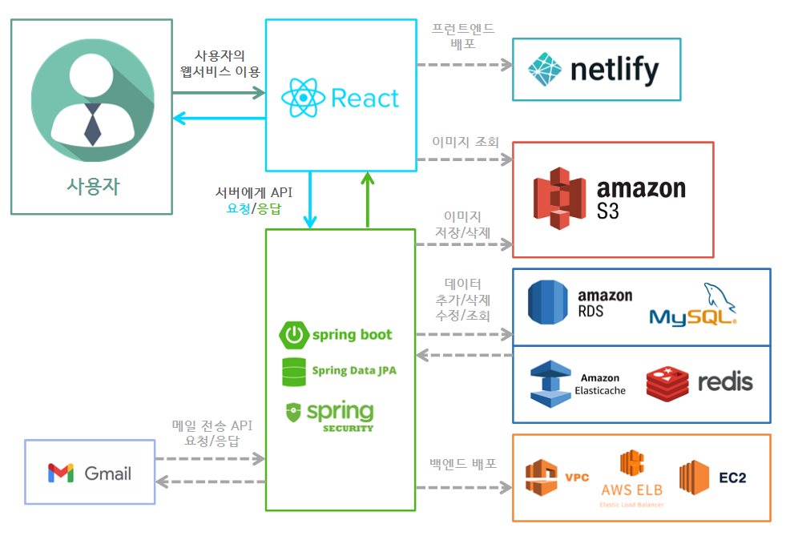

# Group-Group 웹서비스

## Group-Group 웹서비스 소개
Group-Group 웹서비스는 조별과제/공모전/대회/스터디 등을 위해 교내에서 팀을 모집하거나 팀에 참가하고 싶을 때 간편하게 이용할 수 있는 교내 팀모집 웹서비스이다.

## Group-Group 팀 역할분담
- 김정우(BE) : 서버구축, DB설계/관리, 배포, 디자인, 프런트엔드 기능구현
- 주서영(FE) : 디자인, 웹페이지 작성, 테스트
- 이승민(FE) : 디자인, 웹페이지 작성, 테스트
- 서은서(FE) : 웹페이지 작성

## 기술 스택
- ### 백엔드
  -  자바 / 스프링 부트
  - 스프링 데이터 JPA
- ### 프런트
  - React
- ### 데이터베이스 / 캐시
  - MySQL
  - Redis
- ### 배포
  - AWS (VPC, RDS, S3, ElasticCache, EC2, ELB, Route53)
  - Netlify
- ### 협업툴
  - Git / Github
  - Notion
- ### 그외
  - Intellij IDEA, Visual Studio Code
  - Postman
  - Dbeaver

## Group-Group 웹서비스 이용안내

- 팀모집자의 서비스 이용흐름  
  

- 신청자의 서비스 이용흐름  
  

## Group-Group 웹서비스 프로젝트 구조
- 전체적인 프로젝트 구조  
  

- 엔티티 구조도  
  

## 구현한 기능 요약
- ### 회원가입
  - 이메일 인증을 통한 회원가입

- ### 로그인
  - 이메일 / 비밀번호를 통한 로그인
  - 이후 같은 계정으로의 중복 로그인은 허용하지 않음

- ### 모집글 검색
  - 모집글 제목을 기준으로 모집글들을 검색

- ### 모집글 등록
  - 팀소개를 위한 내용작성
  - 팀에 참가하기 위한 참여요건을 마음대로 구성
  - 또한 구성 참여요건에 대해 신청자에게 요구하는 제출물 타입을 마음대로 구성

- ### 모집글 업데이트
  - 작성한 모집글 수정
  - 업데이트 이전 기준의 모집글에 대한 신청데이터는 그대로 유지

- ### 모집글 삭제
  - 모집글을 삭제하고, 관련된 신청 데이터도 모두 삭제처리
  - 신청자 입장에서 삭제처리된 신청 데이터는 신청 목록 페이지에서 필터로 확인가능

- ### 팀 신청
  - 모집자가 구성한 참여요건에 대한 제출물을 제출해야지 신청이 진행되도록 강제한다.

- ### 팀 신청/수락
  - 모집자가 팀 참가 신청에 대해 수락을 할 경우, 신청자에게 팀 오픈채팅방 주소가 보여지게 되고 팀활동에 참가하게 된다.

- ### 회원탈퇴
  - 회원이 작성한 모든 모집글과 신청글을 함께 삭제
  - 삭제된 모집글들에 대한 신청 데이터도 모두 삭제처리
  - 마찬가지로 신청자 입장에서 삭제처리된 신청 데이터는 신청 목록 페이지에서 필터로 확인가능

## 실제 서비스 이미지
- 로그인  
  
- 회원가입  
  
- 모집글 목록 페이지  
  
- 모집글 작성 페이지  
  
- 신청 페이지  
  
- 자신이 작성한 모집글 목록 페이지  
  
- 신청 목록 페이지  
  

## 프로젝트 Github 주소
- 프런트 파트 프로젝트 GitHub 주소 : [https://github.com/KJungW/capstone-group_group-front](https://github.com/KJungW/capstone-group_group-front) \
- 백엔드 파트 프로젝트 GitHub 주소 : [https://github.com/KJungW/capstone-group_group-backend](https://github.com/KJungW/capstone-group_group-backend)
